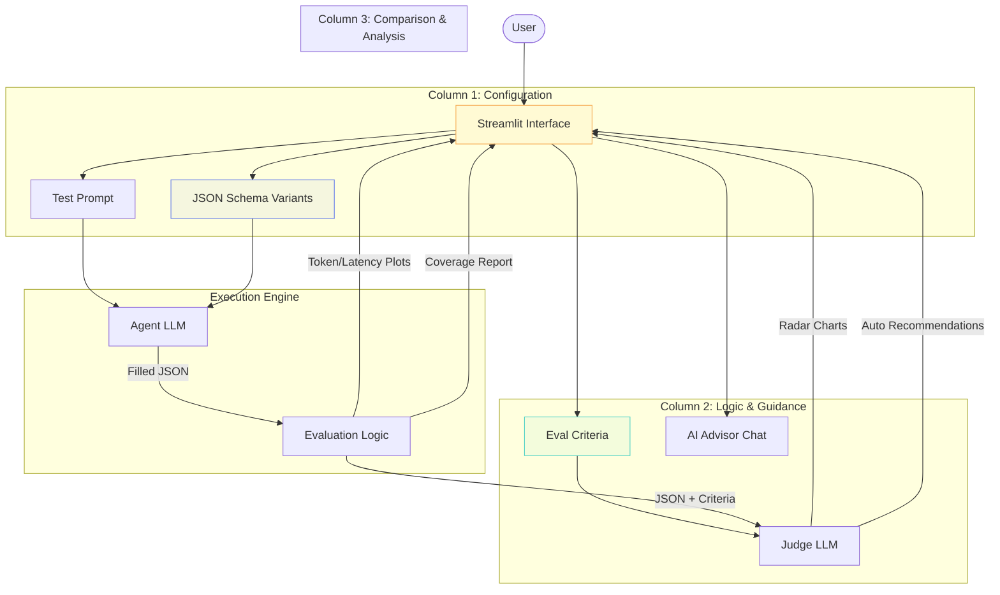

# 🔬 SchemaGain — JSON Schema Variant Evaluator for LLM Agents

**Measure the gain (or loss) from changing JSON schemas passed to your LLM agents.**

SchemaGain is a 3-column Streamlit application that lets you A/B test JSON schema variants against your LLM agents, using LLM-as-a-judge evaluation across three dimensions:

- **Efficiency** — Token cost and latency per schema variant
- **Coverage** — Does the schema correctly capture all required fields?
- **Quality** — Does changing the schema actually improve content accuracy?

## Architecture



## Setup

1. Clone the repository:
```bash
git clone <repository-url>
cd <repository-directory>
```

2. Create a virtual environment using `uv`:
```bash
uv venv
```

3. Activate the virtual environment:
- On Windows: `.venv\Scripts\activate`
- On macOS/Linux: `source .venv/bin/activate`

4. Install the required packages:
```bash
uv pip install streamlit openai plotly pydantic
```

## Usage

```bash
uv run streamlit run app.py
```

1. Enter your **OpenAI API key** in the sidebar
2. **Column 1**: Add/edit JSON schema variants (2 examples pre-loaded)
3. **Column 2**: Define evaluation criteria or use AI to suggest more
4. Click **Run Evaluation** to test all variants
5. **Column 3**: View comparative results, charts, and recommendations

### 🔄 Dynamic Schema Injection
You can control exactly where the JSON schema is placed in your request by using the `{{schema}}` placeholder in your **Test Prompt**.
- **Usage**: `Please extract the following information and conform to this schema: {{schema}}`
- **Fallback**: if the placeholder is not found, SchemaGain will automatically inject the schema into the System Message for you.

## Features

### Schema Input (Column 1)
- Tabbed interface for multiple schema variants
- Live field count, required field count, and token stats
- Add/remove schemas dynamically
- Pre-loaded with flat vs nested examples

### Evaluation & Advisor (Column 2)
- Editable evaluation criteria
- **AI Suggest** button analyzes your schemas and proposes additional criteria
- **Chat Advisor** bot with knowledge of:
  - "Let Me Speak Freely?" (Tam et al., EMNLP 2024) findings
  - JSONSchemaBench methodology
  - SLOT framework for decoupling formatting from reasoning
  - Practical evaluation best practices

### Results & Charts (Column 3)
- **Quality radar chart** (accuracy, completeness, relevance, overall)
- **Token usage** stacked bar chart (prompt vs completion)
- **Latency** comparison bars
- **Coverage** score with missing/extra field details
- **Auto-generated recommendations** including research-backed insights

## Configuration

| Setting | Description | Default |
|---------|-------------|---------|
| Agent Model | Model that generates output | gpt-4o-mini |
| Judge Model | Model that evaluates quality | gpt-4o-mini |
| Trials | Runs per schema (averaged) | 3 |
| Temperature | Agent creativity level | 0.3 |

## Research References

This tool's methodology is informed by:

- **Tam et al. (EMNLP 2024)** — "Let Me Speak Freely?" — 10-15% reasoning degradation under strict format constraints
- **Geng et al. (2025)** — JSONSchemaBench — 10K real-world schemas for benchmarking
- **Wang et al. (EMNLP 2025)** — SLOT — Decoupling output formatting from task performance
- **Cleanlab (2025)** — Verified structured output benchmarks

## License

MIT
